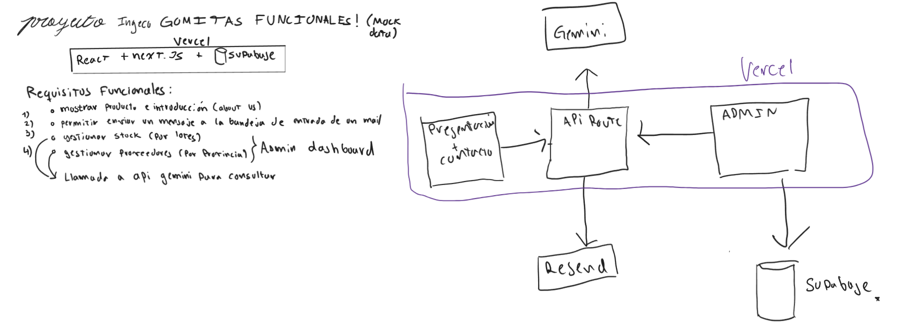

# Proyecto-Gomitas-Funcionales
Pagina prototipo para el proyecto de inversion de Gomitas a base del orujo de uva. Contempla el producto principal, comunicacion con los productores de las gomitas a traves de email, y un panel de administrador con informacion acerca de proveedores y stock por lotes.

Aqui adjunto una documentacion muy vaga acerca de los requisitos funcionales y una arquitectura tentativa

